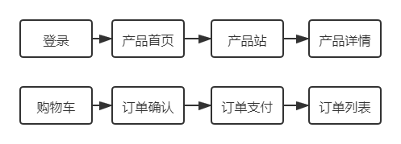
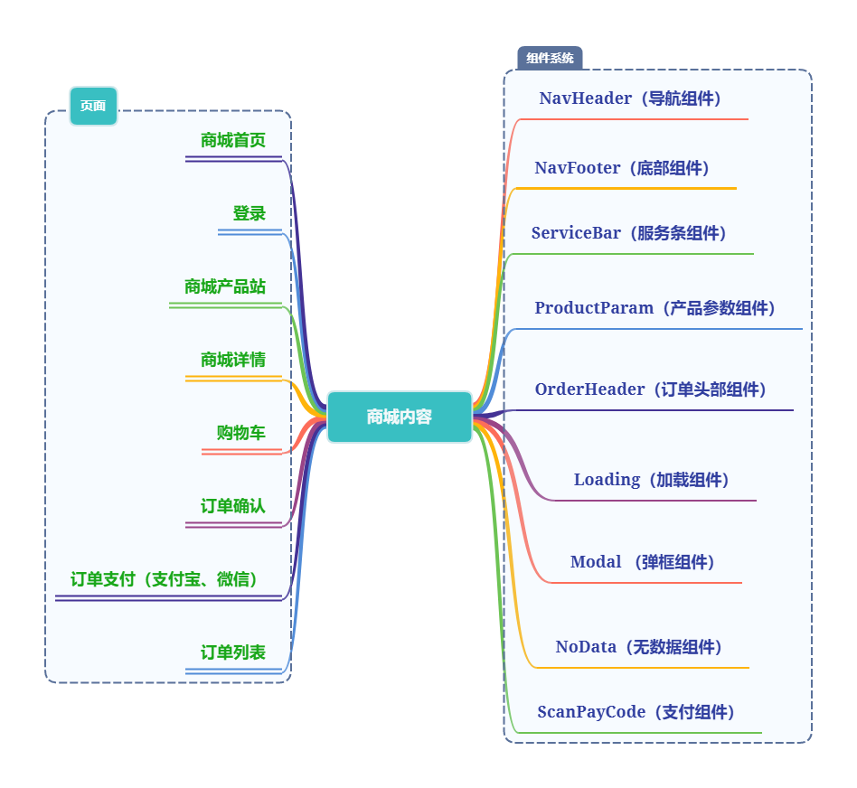

# ElectronicCommerceProject
#### 基于小米电商平台采用vue.js全家桶实现

> 包含需求分析


> `views`视图层中的目录结构

```markdown
```

> 项目流程



> 核心技术



> Node 环境升级

- 下载 `n` 模块进行

```text
    1: npm i -g n
    稳定版本： n stable
    最新LTS版本： n lts
    最新版本： n latest
    某一个版本： n 10.0.0
```

前端跨域解决
-

**描述**

- 浏览器请求必须遵循同源策略： `同域名` 、 `同端口` 、 `同协议`

> `CORS` 跨域

> `JSONP` 跨域

- 是一个js脚本

> 代理跨域

- 通过修改 `nginx` 服务器配置来实现

- 通过 `vue.config.js` 中设置 `proxy` 代理实现

**前后端接口字段规范**

- `status` 设置为 `0` 表示成功登录

- `status` 设置为 `10` 表示未登录

- `data` 表示 数据存储

```json
    {
      "status": 0,
      "data": {}
    }
```

Storage 封装
-

> `Cookie` 和 `localStorage` 和 `sessionStorage` 三者区别

- 为什么要封装 `Storage` 本身不是已经由 `API`

请求响应拦截
-

- 统一报错

- 未登录统一拦截

- 请求值、返回值统一处理

